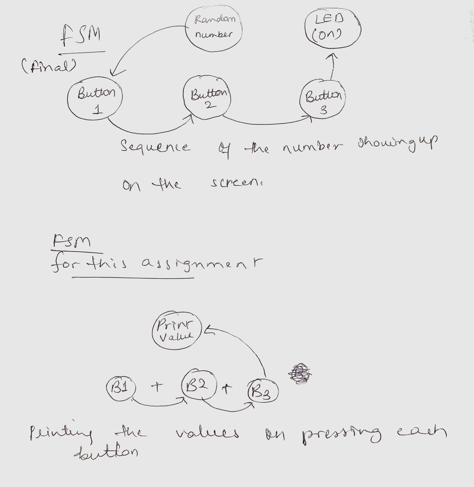

I plan on coding a memory game, with numbers flashing on the screen and buttons on the breadboard that correspond to those buttons on the breadboard, once the correct sequence is followed, the green led turns on. 

Circuit picture- 

Circuit diagram - 

FSM- 

For the Final I plan on using P5Js and Arduino as the libraries. This project would connect the idea of having several buttons and visuals on the screen and making a sort of sequence everytime the numbers are displayed on the screen with the corresponding button on the breadboard. My aim is to create an interactive way to incorporate all the things we have learnt in coding so far.  